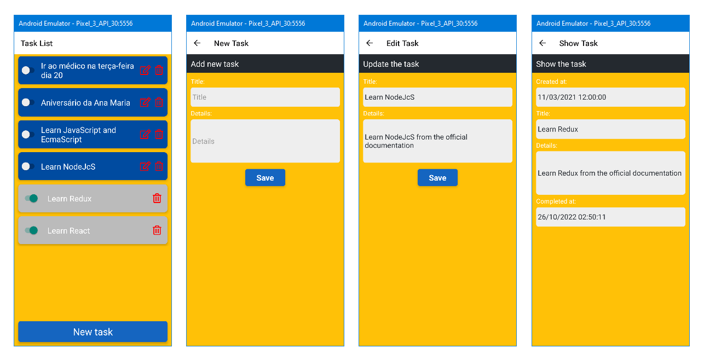

## Description

A simple implementation of a Todo Task developed using React Native

It uses json-server as API server

## Installation

```bash
$ npm install
```

## Running the app

```bash
# development
$ npm react-native run-android
```
